## CellChat uses for:

### 1.analyze cell-cell communication.

### 2.characterize and compare the inferred cell-cell communication networks.

### 3.extracting and visualizing high-order information of the inferred networks.

**load the required libraries and the scData**

    library(data.table)
    library(CellChat)
    ## Loading required package: ggplot2

    library(patchwork)
    options(stringsAsFactors = FALSE)
    library(dplyr)
    library(ggalluvial)
    library(Seurat)

    ## Attaching SeuratObject

    library(doParallel)

    detectCores()

    ## [1] 2

    registerDoParallel(cores = 2)

    future::plan("multiprocess", workers = 2) # do parallel
    Sys.sleep(2)
    # Load the scdata dataset
    df.data <- read.table("/home/balqees/Documents/Data/scrdatafile.txt")
    Sys.sleep(2)
    #transpose data frame
    df.data <- transpose(df.data)
    Sys.sleep(2)
    # data preparation 
    #========================
    rownames(df.data) <- df.data$V1
    df.data <- df.data[,-1]
    colnames(df.data) <- df.data[1,]
    df.data <- df.data[-1,]
    Sys.sleep(2)

## Step.1 Data Subsets (Counts Data)

    # subset tumor number 79
    mel79.data <- df.data[which(df.data[,1] == "79"),]

    # set 7 to malignant cells
    mel79.data[which(mel79.data$`malignant(1=no,2=yes,0=unresolved)` == 2),3] = 7

    # set 9 to unresolved cells

    mel79.data[which(mel79.data$`malignant(1=no,2=yes,0=unresolved)` == 0 & mel79.data$`non-malignant cell type (1=T,2=B,3=Macro.4=Endo.,5=CAF;6=NK)` == 0) , 3] = 9
    # set 8 to non.malignant cells

    mel79.data[which(mel79.data$`malignant(1=no,2=yes,0=unresolved)` == 1 & mel79.data$`non-malignant cell type (1=T,2=B,3=Macro.4=Endo.,5=CAF;6=NK)` == 0) , 3] = 8
    # explore all cell groups

    table(mel79.data$`non-malignant cell type (1=T,2=B,3=Macro.4=Endo.,5=CAF;6=NK)`)

    ## 
    ##   1   2   4   5   6   7   8   9 
    ## 304  79   2   1   1 468  16  25

    # drop 2 columns
    mel79.data <- mel79.data[,-1]
    mel79.data <- mel79.data[,-1]

    mel79.data[which(mel79.data$`non-malignant cell type (1=T,2=B,3=Macro.4=Endo.,5=CAF;6=NK)` == 1),1] = "Tcell"
    mel79.data[which(mel79.data$`non-malignant cell type (1=T,2=B,3=Macro.4=Endo.,5=CAF;6=NK)` == 2),1] = "Bcell"
    mel79.data[which(mel79.data$`non-malignant cell type (1=T,2=B,3=Macro.4=Endo.,5=CAF;6=NK)` == 3),1] = "Macro"
    mel79.data[which(mel79.data$`non-malignant cell type (1=T,2=B,3=Macro.4=Endo.,5=CAF;6=NK)` == 4),1] = "Endo"
    mel79.data[which(mel79.data$`non-malignant cell type (1=T,2=B,3=Macro.4=Endo.,5=CAF;6=NK)` == 5),1] = "CAF" 
    mel79.data[which(mel79.data$`non-malignant cell type (1=T,2=B,3=Macro.4=Endo.,5=CAF;6=NK)` == 6),1] = "NK" 
    mel79.data[which(mel79.data$`non-malignant cell type (1=T,2=B,3=Macro.4=Endo.,5=CAF;6=NK)` == 7),1] = "Mel79" 
    mel79.data[which(mel79.data$`non-malignant cell type (1=T,2=B,3=Macro.4=Endo.,5=CAF;6=NK)` == 8),1] = "Nrml79" 
    mel79.data[which(mel79.data$`non-malignant cell type (1=T,2=B,3=Macro.4=Endo.,5=CAF;6=NK)` == 9),1] = "Urslvd" 

### Create and Prepare meta data for CellChat object:

    # create meta data frame
    df <- data.frame(rownames(mel79.data),  mel79.data[,1])
    row.names(df) <-  df[,1]
    colnames(df)[2]  <- "labels"
    mel79.metadata <- subset(df, select = c("labels"))
    # drop metadata column
    mel79.data <- mel79.data[,-1] # normalized data matrix
    unique(mel79.metadata$labels) # check the cell labels

    ## [1] "Nrml79" "Bcell"  "Tcell"  "Mel79"  "Urslvd" "Endo"   "CAF"    "NK"

## Create seurat object

    # Initialize the Seurat object with the raw (normalized data).
    seurat.mel79data <- CreateSeuratObject(counts =  t(mel79.data), project = "mel79", min.cells = 3, min.features = 10)

    ## Warning: Feature names cannot have underscores ('_'), replacing with dashes
    ## ('-')

## Step.2 Creat CellChat object

    # Create a CellChat object
    cellchat <- createCellChat(object = seurat.mel79data, meta = mel79.metadata, group.by = "labels")

    ## [1] "Create a CellChat object from a Seurat object"
    ## The `data` slot in the default assay is used. The default assay is RNA 
    ## Set cell identities for the new CellChat object 
    ## The cell groups used for CellChat analysis are  Bcell CAF Endo Mel79 NK Nrml79 Tcell Urslvd

    cellchat <- addMeta(cellchat, meta = mel79.metadata)
    cellchat <- setIdent(cellchat, ident.use = "labels") # set "labels" as default cell identity
    levels(cellchat@idents) # show factor levels of the cell labels

    ## [1] "Bcell"  "CAF"    "Endo"   "Mel79"  "NK"     "Nrml79" "Tcell"  "Urslvd"

    groupSize <- as.numeric(table(cellchat@idents)) # number of cells in each cell group

    CellChatDB <- CellChatDB.human # use CellChatDB.mouse if running on mouse data
    showDatabaseCategory(CellChatDB)

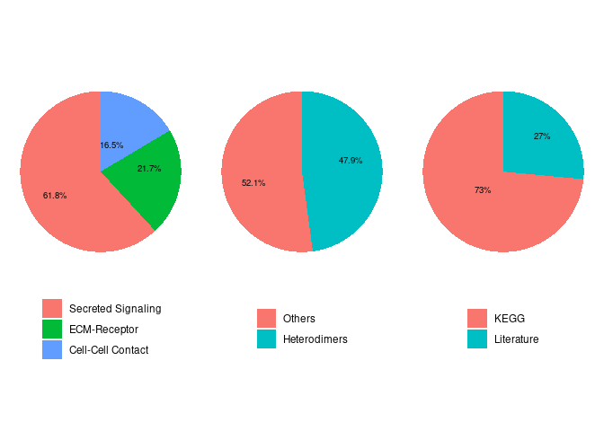

    # Show the structure of the database
    dplyr::glimpse(CellChatDB$interaction)

    ## Rows: 1,939
    ## Columns: 11
    ## $ interaction_name   <chr> "TGFB1_TGFBR1_TGFBR2", "TGFB2_TGFBR1_TGFBR2", "TGFB…
    ## $ pathway_name       <chr> "TGFb", "TGFb", "TGFb", "TGFb", "TGFb", "TGFb", "TG…
    ## $ ligand             <chr> "TGFB1", "TGFB2", "TGFB3", "TGFB1", "TGFB1", "TGFB2…
    ## $ receptor           <chr> "TGFbR1_R2", "TGFbR1_R2", "TGFbR1_R2", "ACVR1B_TGFb…
    ## $ agonist            <chr> "TGFb agonist", "TGFb agonist", "TGFb agonist", "TG…
    ## $ antagonist         <chr> "TGFb antagonist", "TGFb antagonist", "TGFb antagon…
    ## $ co_A_receptor      <chr> "", "", "", "", "", "", "", "", "", "", "", "", "",…
    ## $ co_I_receptor      <chr> "TGFb inhibition receptor", "TGFb inhibition recept…
    ## $ evidence           <chr> "KEGG: hsa04350", "KEGG: hsa04350", "KEGG: hsa04350…
    ## $ annotation         <chr> "Secreted Signaling", "Secreted Signaling", "Secret…
    ## $ interaction_name_2 <chr> "TGFB1 - (TGFBR1+TGFBR2)", "TGFB2 - (TGFBR1+TGFBR2)…

## Preprocessing the expression data for cell-cell communication analysis.

    # use a subset of CellChatDB for cell-cell communication analysis
    CellChatDB.use <- subsetDB(CellChatDB, search = "Secreted Signaling") # use Secreted Signaling
    # set the used database in the object
    cellchat@DB <- CellChatDB.use

    # subset the expression data of signaling genes for saving computation cost
    cellchat <- subsetData(cellchat) # This step is necessary even if using the whole database

    cellchat <- identifyOverExpressedGenes(cellchat)
    cellchat <- identifyOverExpressedInteractions(cellchat)
    # project gene expression data onto PPI (Optional: when running it, USER should set `raw.use = FALSE` in the function `computeCommunProb()` in order to use the projected data)
    cellchat <- projectData(cellchat, PPI.human)

## Step.3 Inference of cell-cell communication network.

### Compute the communication probability and infer cellular communication network.

    cellchat <- computeCommunProb(cellchat)

    ## triMean is used for calculating the average gene expression per cell group. 
    ## [1] ">>> Run CellChat on sc/snRNA-seq data <<< [2023-02-25 23:34:25]"
    ## [1] ">>> CellChat inference is done. Parameter values are stored in `object@options$parameter` <<< [2023-02-25 23:39:34]"

### Infer the cell-cell communication at a signaling pathway level

    cellchat <- computeCommunProbPathway(cellchat)

### Calculate the aggregated cell-cell communication network.

    cellchat <- aggregateNet(cellchat)
    cellchat

    ## An object of class CellChat created from a single dataset 
    ##  18692 genes.
    ##  896 cells. 
    ## CellChat analysis of single cell RNA-seq data!

### visualize the aggregated cell-cell communication network. For example, showing the number of interactions or the total interaction strength (weights) between any two cell groups using circle plot.

    groupSize <- as.numeric(table(cellchat@idents))
    par(mfrow = c(1,2), xpd=TRUE)
    netVisual_circle(cellchat@net$count, vertex.weight = groupSize, weight.scale = T,  label.edge= T, title.name = "Number of interactions")
    netVisual_circle(cellchat@net$weight, vertex.weight = groupSize, weight.scale = T, label.edge= F, title.name = "Interaction weights/strength")

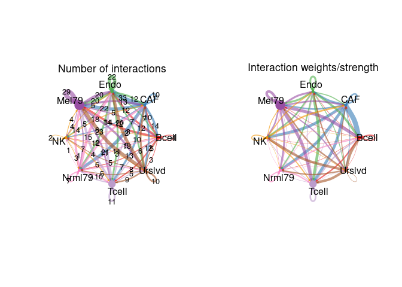
### examine the signaling sent from each cell group.

    mat <- cellchat@net$weight
    par(mfrow = c(3,4), xpd=TRUE)
    for (i in 1:nrow(mat)) {
      mat2 <- matrix(0, nrow = nrow(mat), ncol = ncol(mat), dimnames = dimnames(mat))
      mat2[i, ] <- mat[i, ]
      netVisual_circle(mat2, vertex.weight = groupSize, weight.scale = T, edge.weight.max = max(mat), title.name = rownames(mat)[i])
    }

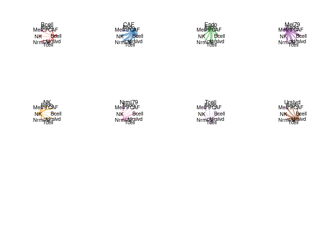

    # pathways visualization (TGFb ,WNT ,NOTCH)
    pathways.show<- c("WNT")
    vertex.receiver = seq(1,4) # a numeric vector. 
    netVisual_aggregate(cellchat, signaling = pathways.show,  vertex.receiver = vertex.receiver)

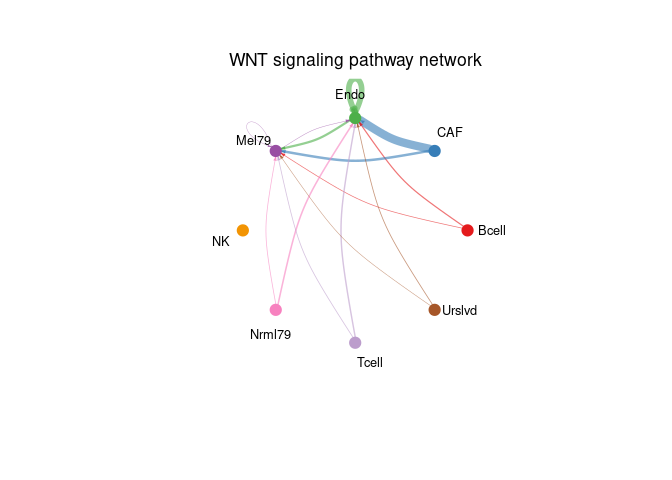

    par(mfrow=c(1,1))
    netVisual_aggregate(cellchat, signaling = pathways.show, layout = "circle")

### Chord diagram

    # Chord diagram
    par(mfrow=c(1,1))
    netVisual_aggregate(cellchat, signaling = pathways.show, layout = "chord")

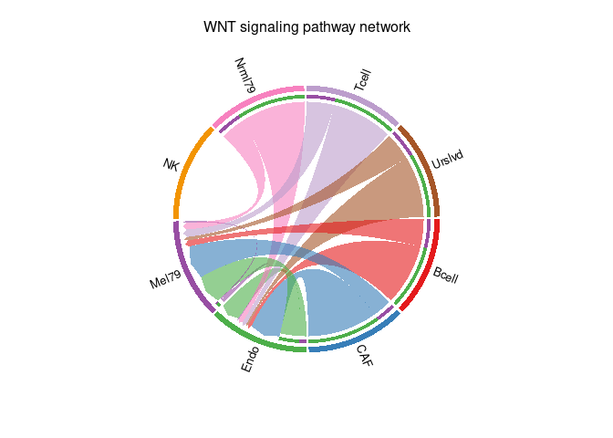
\### Heatmap

    # Heatmap
    par(mfrow=c(1,1))
    netVisual_heatmap(cellchat, signaling = pathways.show, color.heatmap = "Reds")

    ## Do heatmap based on a single object

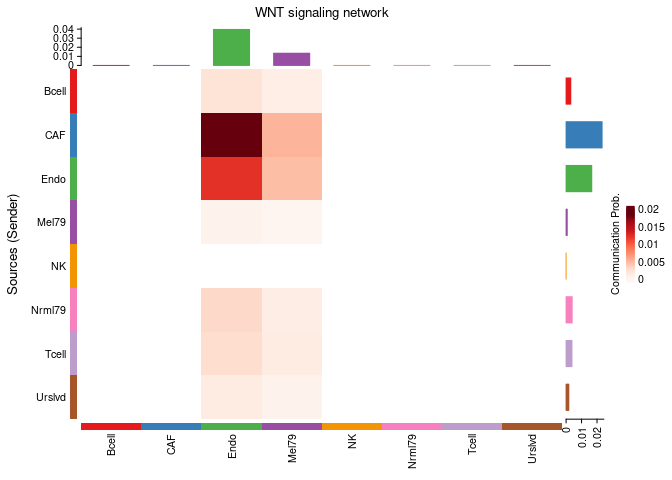

    # Chord diagram
    group.cellType <- c(rep("Bcell", 4), rep("CAF", 4), rep("Mel79", 4), rep("Tcell", 4), rep("Endo", 4)) # grouping cell clusters into fibroblast, DC and TC cells
    names(group.cellType) <- levels(cellchat@idents)
    netVisual_chord_cell(cellchat, signaling = pathways.show, group = group.cellType, title.name = paste0(pathways.show, " signaling network"))

    ## Plot the aggregated cell-cell communication network at the signaling pathway level

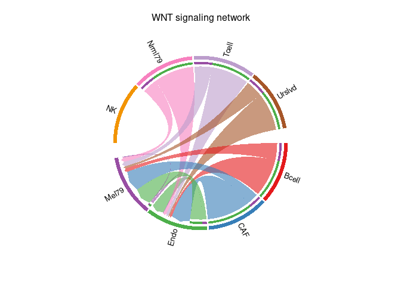

    netAnalysis_contribution(cellchat, signaling = pathways.show)

    pairLR.CXCL <- extractEnrichedLR(cellchat, signaling = pathways.show, geneLR.return = FALSE)
    LR.show <- pairLR.CXCL[1,] # show one ligand-receptor pair
    # Hierarchy plot
    vertex.receiver = seq(1,4) # a numeric vector
    netVisual_individual(cellchat, signaling = pathways.show,  pairLR.use = LR.show, vertex.receiver = vertex.receiver)

    ## [[1]]

## WNT pathway

    netAnalysis_contribution(cellchat, signaling = pathways.show)

    pairLR.CXCL <- extractEnrichedLR(cellchat, signaling = pathways.show, geneLR.return = FALSE)
    LR.show <- pairLR.CXCL[1,] # show one ligand-receptor pair
    # Hierarchy plot
    vertex.receiver = seq(1,4) # a numeric vector
    netVisual_individual(cellchat, signaling = pathways.show,  pairLR.use = LR.show, vertex.receiver = vertex.receiver)

    ## [[1]]

    # Circle plot
    netVisual_individual(cellchat, signaling = pathways.show, pairLR.use = LR.show, layout = "circle")

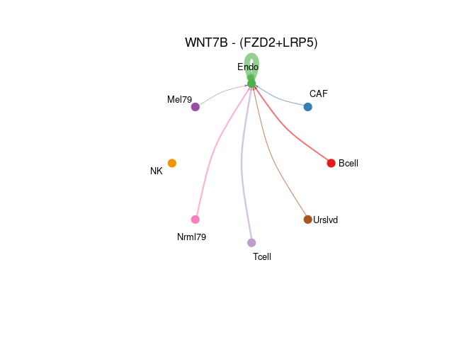

    ## [[1]]

    # Chord diagram
    netVisual_individual(cellchat, signaling = pathways.show, pairLR.use = LR.show, layout = "chord")

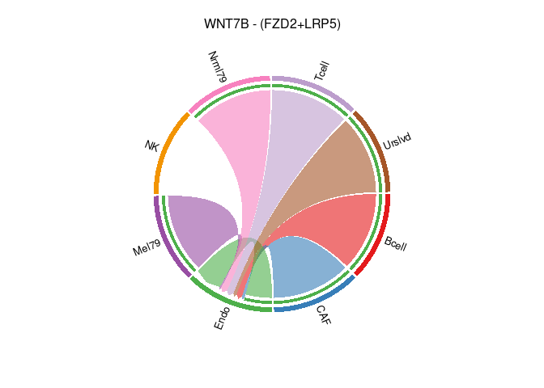

    ## [[1]]

## NOTCH pathway

    netAnalysis_contribution(cellchat, signaling = pathways.show)

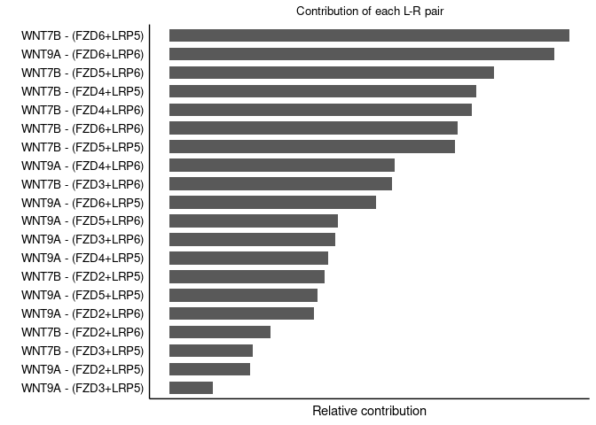

    pairLR.CXCL <- extractEnrichedLR(cellchat, signaling = pathways.show, geneLR.return = FALSE)
    LR.show <- pairLR.CXCL[1,] # show one ligand-receptor pair
    # Hierarchy plot
    vertex.receiver = seq(1,4) # a numeric vector
    netVisual_individual(cellchat, signaling = pathways.show,  pairLR.use = LR.show, vertex.receiver = vertex.receiver)

    ## [[1]]

    # Circle plot
    netVisual_individual(cellchat, signaling = pathways.show, pairLR.use = LR.show, layout = "circle")

    ## [[1]]

    # Chord diagram
    netVisual_individual(cellchat, signaling = pathways.show, pairLR.use = LR.show, layout = "chord")

    ## [[1]]

## TGFb pathway

    #netAnalysis_contribution(cellchat, signaling = pathways.show3)
    #pairLR.CXCL <- extractEnrichedLR(cellchat, signaling = pathways.show3, geneLR.return = FALSE)
    #LR.show <- pairLR.CXCL[1,] # show one ligand-receptor pair
    # Hierarchy plot
    #vertex.receiver = seq(1,4) # a numeric vector
    #netVisual_individual(cellchat, signaling = pathways.show3,  pairLR.use = LR.show, vertex.receiver = vertex.receiver)
    # Circle plot
    #netVisual_individual(cellchat, signaling = pathways.show3, pairLR.use = LR.show, layout = "circle")
    # Chord diagram
    #netVisual_individual(cellchat, signaling = pathways.show3, pairLR.use = LR.show, layout = "chord")

    # show all the significant interactions (L-R pairs) from some cell groups (defined by 'sources.use') to other cell groups (defined by 'targets.use')
    netVisual_bubble(cellchat, sources.use =4, targets.use = c(5:11), remove.isolate = FALSE,font.size = 5)

    ## Comparing communications on a single object

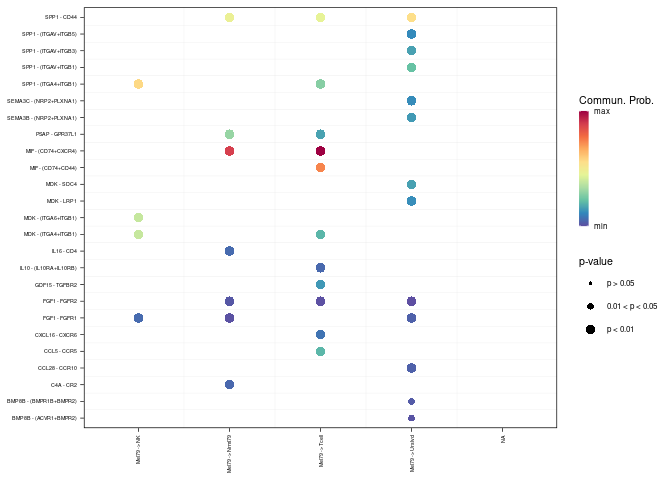

    #Comparing communications on a single object
    # show all the significant interactions (L-R pairs) associated with certain signaling pathways
    netVisual_bubble(cellchat, sources.use = 4, targets.use = c(5:11), signaling = c("WNT"), remove.isolate = FALSE,font.size = 6)

    ## Comparing communications on a single object

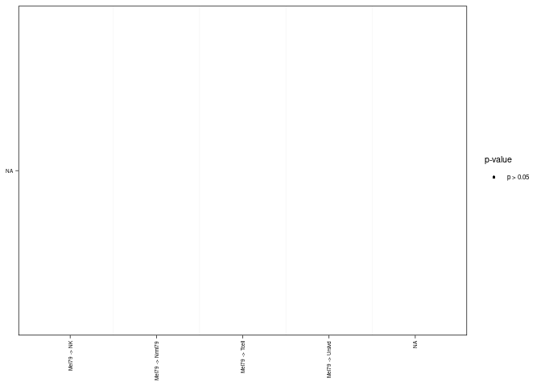

    # show all the significant interactions (L-R pairs) based on user's input (defined by `pairLR.use`)
    #pairLR.use <- extractEnrichedLR(cellchat, signaling = c("WNT"))
    #netVisual_bubble(cellchat, sources.use = c(3,4), targets.use = c(5:8), pairLR.use = pairLR.use, remove.isolate = TRUE)

    # show all the significant interactions (L-R pairs) from some cell groups (defined by 'sources.use') to other cell groups (defined by 'targets.use')
    # show all the interactions 
    netVisual_chord_gene(cellchat, sources.use = 4, targets.use = c(5:11), lab.cex = 0.5,legend.pos.y = 30)

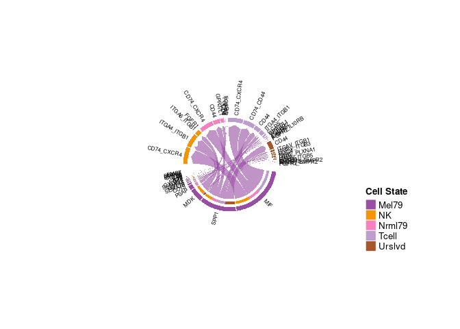

    # show all the interactions received by 
    netVisual_chord_gene(cellchat, sources.use = c(1,2,3,4), targets.use = 8, legend.pos.x = 15)

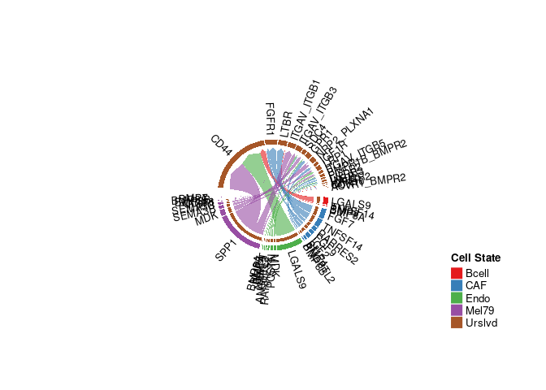

    # show all the significant interactions (L-R pairs) associated with certain signaling pathways
    netVisual_chord_gene(cellchat, sources.use = c(1,2,3,4), targets.use = c(5:11), signaling = c("CCL","CXCL"),legend.pos.x = 8)

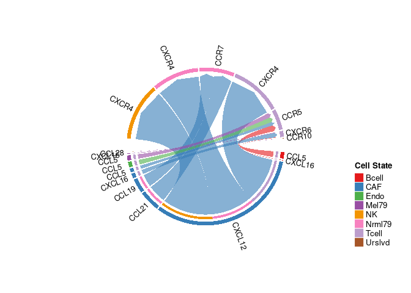

    # show all the significant signaling pathways from some cell groups (defined by 'sources.use') to other cell groups (defined by 'targets.use')
    netVisual_chord_gene(cellchat, sources.use = c(1,2,3,4), targets.use = c(5:11), slot.name = "netP", legend.pos.x = 10)

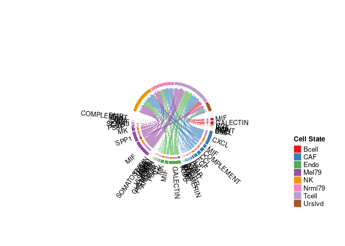

    plotGeneExpression(cellchat, signaling = "WNT")

    ## Scale for y is already present.
    ## Adding another scale for y, which will replace the existing scale.
    ## Scale for y is already present.
    ## Adding another scale for y, which will replace the existing scale.
    ## Scale for y is already present.
    ## Adding another scale for y, which will replace the existing scale.
    ## Scale for y is already present.
    ## Adding another scale for y, which will replace the existing scale.
    ## Scale for y is already present.
    ## Adding another scale for y, which will replace the existing scale.
    ## Scale for y is already present.
    ## Adding another scale for y, which will replace the existing scale.
    ## Scale for y is already present.
    ## Adding another scale for y, which will replace the existing scale.
    ## Scale for y is already present.
    ## Adding another scale for y, which will replace the existing scale.
    ## Scale for y is already present.
    ## Adding another scale for y, which will replace the existing scale.

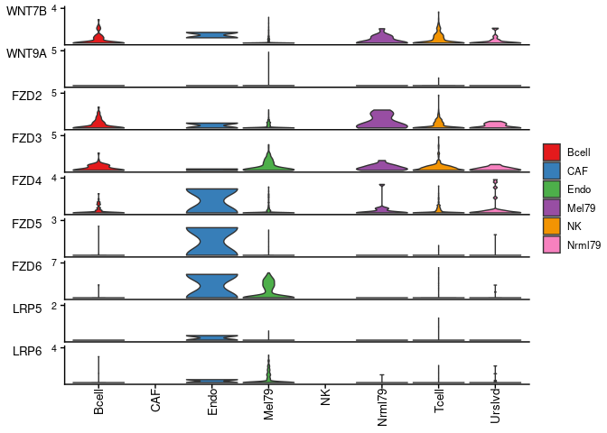

    plotGeneExpression(cellchat, signaling = "WNT", enriched.only = FALSE)

    ## Scale for y is already present.
    ## Adding another scale for y, which will replace the existing scale.
    ## Scale for y is already present.
    ## Adding another scale for y, which will replace the existing scale.
    ## Scale for y is already present.
    ## Adding another scale for y, which will replace the existing scale.
    ## Scale for y is already present.
    ## Adding another scale for y, which will replace the existing scale.
    ## Scale for y is already present.
    ## Adding another scale for y, which will replace the existing scale.
    ## Scale for y is already present.
    ## Adding another scale for y, which will replace the existing scale.
    ## Scale for y is already present.
    ## Adding another scale for y, which will replace the existing scale.
    ## Scale for y is already present.
    ## Adding another scale for y, which will replace the existing scale.
    ## Scale for y is already present.
    ## Adding another scale for y, which will replace the existing scale.
    ## Scale for y is already present.
    ## Adding another scale for y, which will replace the existing scale.
    ## Scale for y is already present.
    ## Adding another scale for y, which will replace the existing scale.
    ## Scale for y is already present.
    ## Adding another scale for y, which will replace the existing scale.
    ## Scale for y is already present.
    ## Adding another scale for y, which will replace the existing scale.
    ## Scale for y is already present.
    ## Adding another scale for y, which will replace the existing scale.
    ## Scale for y is already present.
    ## Adding another scale for y, which will replace the existing scale.

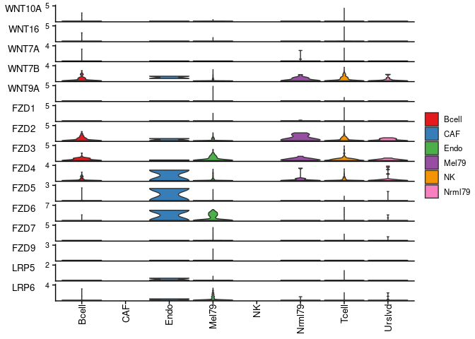
\### Compute the network centrality scores

    # Compute the network centrality scores
    cellchat <- netAnalysis_computeCentrality(cellchat, slot.name = "netP") # the slot 'netP' means the inferred intercellular communication network of signaling pathways
    # Visualize the computed centrality scores using heatmap, allowing ready identification of major signaling roles of cell groups
    netAnalysis_signalingRole_network(cellchat, signaling = pathways.show, width = 8, height = 2.5, font.size = 10)

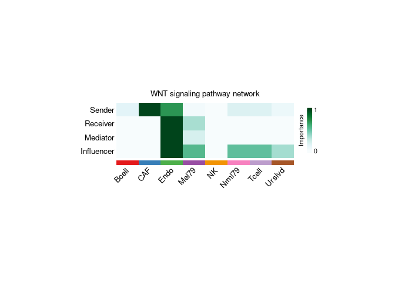

    # Signaling role analysis on the aggregated cell-cell communication network from all signaling pathways
    gg1 <- netAnalysis_signalingRole_scatter(cellchat)

    ## Signaling role analysis on the aggregated cell-cell communication network from all signaling pathways

    #> Signaling role analysis on the aggregated cell-cell communication network from all signaling pathways
    # Signaling role analysis on the cell-cell communication networks of interest
    gg2 <- netAnalysis_signalingRole_scatter(cellchat, signaling = c("WNT", "NOTCH"))

    ## Signaling role analysis on the cell-cell communication network from user's input

    #> Signaling role analysis on the cell-cell communication network from user's input
    gg1 + gg2

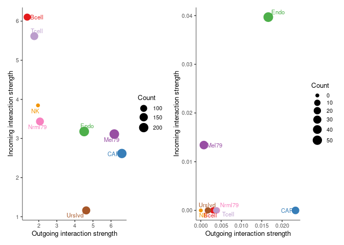

    # Signaling role analysis on the aggregated cell-cell communication network from all signaling pathways
    ht1 <- netAnalysis_signalingRole_heatmap(cellchat, pattern = "outgoing")
    ht2 <- netAnalysis_signalingRole_heatmap(cellchat, pattern = "incoming")
    ht1 

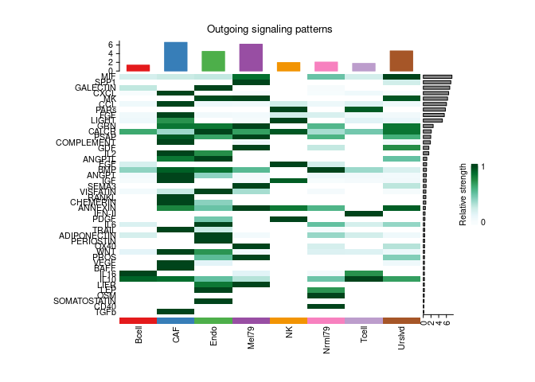

    ht2

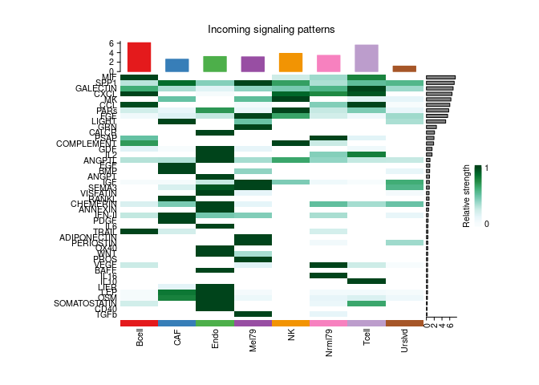

    # Signaling role analysis on the cell-cell communication networks of interest
    ht <- netAnalysis_signalingRole_heatmap(cellchat, signaling = c("WNT", "NOTCH","TGFb"))

    nPatterns = 3
    cellchat <- identifyCommunicationPatterns(cellchat, pattern = "outgoing", k = nPatterns)

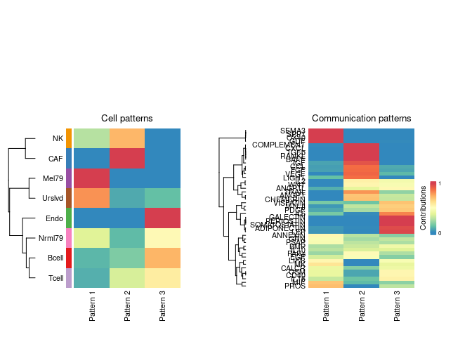

    # dot plot
    #netAnalysis_dot(cellchat, pattern = "outgoing")
    #selectK(cellchat, pattern = "incoming")
    #nPatterns = 4
    #cellchat <- identifyCommunicationPatterns(cellchat, pattern = "incoming", k = nPatterns)

    # river plot
    #netAnalysis_river(cellchat, pattern = "incoming")

    # dot plot
    #netAnalysis_dot(cellchat, pattern = "incoming")

    cellchat <- computeNetSimilarity(cellchat, type = "functional")
    cellchat <- netEmbedding(cellchat, type = "functional")

    ## Manifold learning of the signaling networks for a single dataset

    #> Manifold learning of the signaling networks for a single dataset
    cellchat <- netClustering(cellchat, type = "functional")

    ## Classification learning of the signaling networks for a single dataset

    #> Classification learning of the signaling networks for a single dataset
    # Visualization in 2D-space
    netVisual_embedding(cellchat, type = "functional", label.size = 3.5)

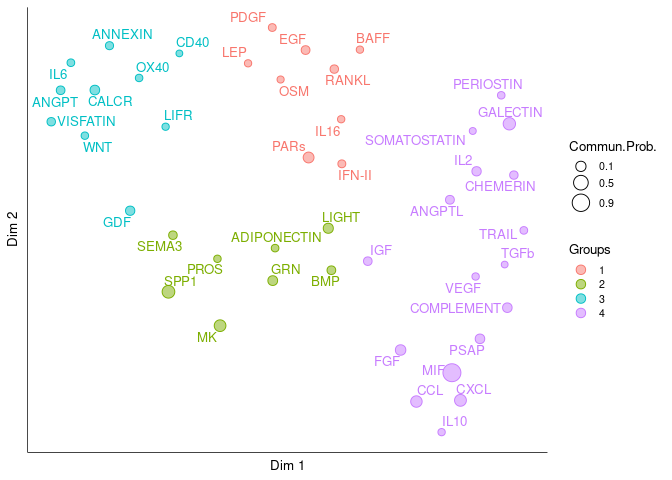

    cellchat <- computeNetSimilarity(cellchat, type = "structural")
    cellchat <- netEmbedding(cellchat, type = "structural")

    ## Manifold learning of the signaling networks for a single dataset

    #> Manifold learning of the signaling networks for a single dataset
    cellchat <- netClustering(cellchat, type = "structural")

    ## Classification learning of the signaling networks for a single dataset

    #> Classification learning of the signaling networks for a single dataset
    # Visualization in 2D-space
    netVisual_embedding(cellchat, type = "structural", label.size = 3.5)

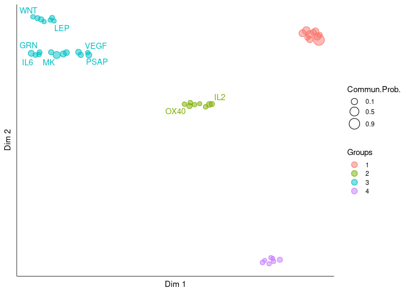

    netVisual_embeddingZoomIn(cellchat, type = "structural", nCol = 2)

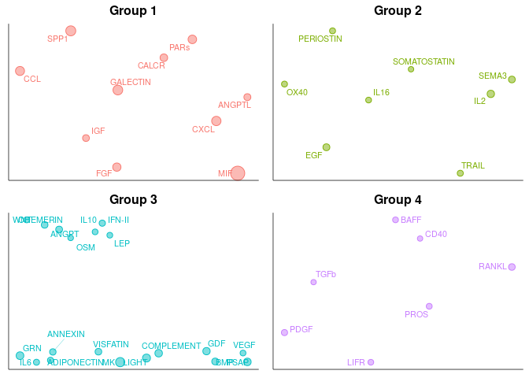
