load libraries
--------------

    library(dplyr)

    ## 
    ## Attaching package: 'dplyr'

    ## The following objects are masked from 'package:stats':
    ## 
    ##     filter, lag

    ## The following objects are masked from 'package:base':
    ## 
    ##     intersect, setdiff, setequal, union

    library(Seurat)

    ## Attaching SeuratObject

    library(patchwork)
    library(data.table)

    ## 
    ## Attaching package: 'data.table'

    ## The following objects are masked from 'package:dplyr':
    ## 
    ##     between, first, last

1. Data Preparations
--------------------

    # Initialize the Seurat object with the raw (non-normalized data).
    Sys.sleep(2)

    # Load the scdata dataset
    df.data <- read.table("scRNA_all.txt")
    Sys.sleep(2)
    #transpose data frame
    df.data <- transpose(df.data)
    Sys.sleep(2)

    # data preparation 
    #========================
    rownames(df.data) <- df.data$V1

    df.data <- df.data[,-1]

    colnames(df.data) <- df.data[1,]

    df.data <- df.data[-1,]

    orgdata.data <- df.data
    #========================
    # unique(df.data$tumor)

    # select malignant data object and remove non-malignant and unresolved
    mal.data <- df.data[(which(df.data$`malignant(1=no,2=yes,0=unresolved)` == 2 )),]

    mal.data <- mal.data[(which(mal.data$tumor == "81" | mal.data$tumor == "78" | mal.data$tumor == "79" | mal.data$tumor == "88" | mal.data$tumor == "80" | mal.data$tumor == "89" )),]

    # unique(mal.data$tumor)
    # table(mal.data$tumor)
    # which(is.na(colnames(mal.data)))
    # drop 3 metadata columns

    mal.data <- mal.data[,-1]
    mal.data <- mal.data[,-1]
    mal.data <- mal.data[,-1]

    # Initialize the Seurat object with the raw (non-normalized data).
    tumor.data <- CreateSeuratObject(counts =  t(mal.data), project = "Mel1k", min.cells = 3, min.features = 10)

    ## Warning: Feature names cannot have underscores ('_'), replacing with dashes
    ## ('-')

    tumor.data

    ## An object of class Seurat 
    ## 19950 features across 1061 samples within 1 assay 
    ## Active assay: RNA (19950 features, 0 variable features)

show the first five cells with meta.data
----------------------------------------

    tumor.data[["percent.mt"]] <- PercentageFeatureSet(tumor.data, pattern = "^MT-")
    # Show QC metrics for the first 5 cells
    head(tumor.data@meta.data, 5)

    ##                              orig.ident nCount_RNA nFeature_RNA percent.mt
    ## Cy81_FNA_CD45_B01_S301_comb       Mel1k   16763.33         6386          0
    ## Cy80_II_CD45_B07_S883_comb        Mel1k   16326.73         5913          0
    ## Cy81_Bulk_CD45_B10_S118_comb      Mel1k   17698.97         8360          0
    ## Cy80_II_CD45_C09_S897_comb        Mel1k   14870.72         6019          0
    ## Cy81_FNA_CD45_E05_S341_comb       Mel1k   18051.43         7718          0

Visualize QC metrics as a violin plot
-------------------------------------

    VlnPlot(tumor.data, features = c("nFeature_RNA" , "nCount_RNA" ,"percent.mt"), ncol = 3)

    ## Warning in SingleExIPlot(type = type, data = data[, x, drop = FALSE], idents =
    ## idents, : All cells have the same value of percent.mt.

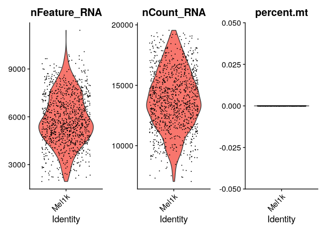

### Or if you don’t like the dots

    VlnPlot(tumor.data, features = c("nFeature_RNA", "nCount_RNA", "percent.mt"), ncol = 3, pt.size=0)

    ## Warning in SingleExIPlot(type = type, data = data[, x, drop = FALSE], idents =
    ## idents, : All cells have the same value of percent.mt.

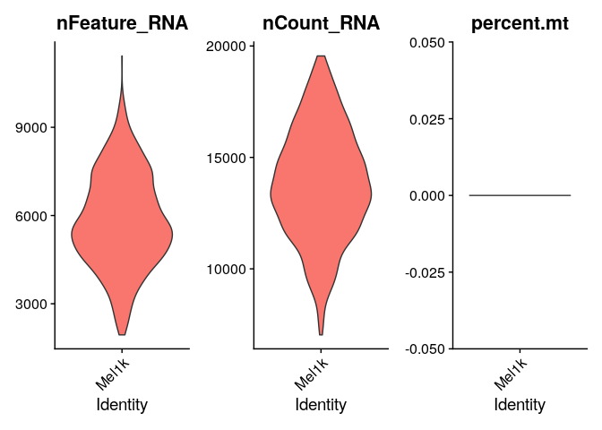
\#\# FeatureScatter to visualize feature-feature relationships

    plot1 <- FeatureScatter(tumor.data, feature1 = "nCount_RNA", feature2 = "percent.mt")

    ## Warning in cor(x = data[, 1], y = data[, 2]): the standard deviation is zero

    plot2 <- FeatureScatter(tumor.data, feature1 = "nCount_RNA", feature2 = "nFeature_RNA")
    plot1 + plot2

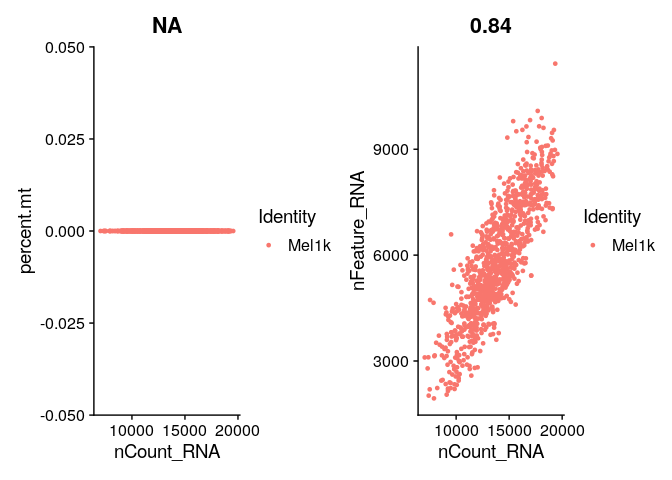

### Filtering based on nFeature &gt;200 and &lt;12000 depending on the previous plot

    tumor.data <- subset(tumor.data, subset = nFeature_RNA > 200 & nFeature_RNA < 12000 & percent.mt < 5)

Step 2. Normalization:
----------------------

**A normalization step, aiming to make gene expression levels between
different cells comparable, is therefore necessary.**

    tumor.data <- NormalizeData(tumor.data, normalization.method = "LogNormalize", scale.factor = 10000)

Step 3. Feature selection for following heterogeneity analysis
--------------------------------------------------------------

**by looking for cell groups with distinct molecular signatures.
However, not every gene has the same level of information and the same
contribution when trying to identify different cell groups. For
instance, genes with low expression levels, and those with similar
expression levels across all cells, are not very informative and may
dilute differences between distinct cell groups. Therefore, it is
necessary to perform a proper feature selection**

    tumor.data <- FindVariableFeatures(tumor.data, selection.method = "vst", nfeatures = 2000)

Top Highly variabl genes
------------------------

    # Identify the 10 most highly variable genes
    top10 <- head(VariableFeatures(tumor.data), 10)
    # plot variable features with and without labels
    plot1 <- VariableFeaturePlot(tumor.data)
    plot2 <- LabelPoints(plot = plot1, points = top10, repel = TRUE)

    ## When using repel, set xnudge and ynudge to 0 for optimal results

    plot1 

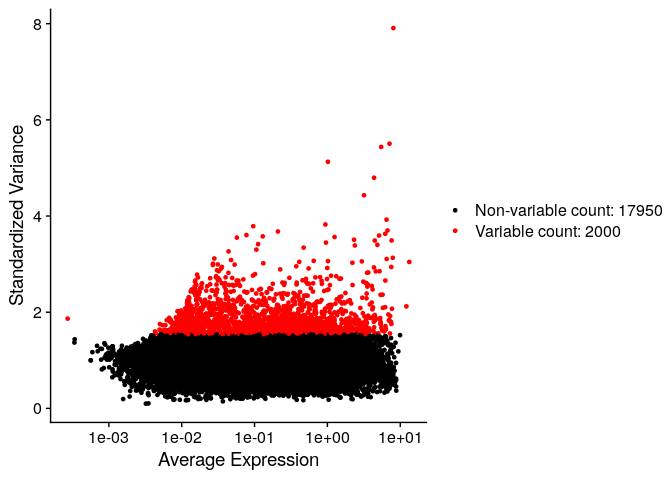

    plot2

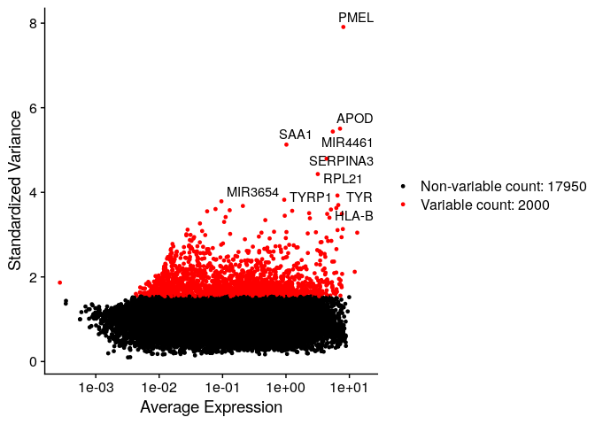

Step 4. Data scaling
--------------------

    ## Centering and scaling data matrix

Step 5. Linear dimensionality reduction using principal component analysis (PCA)
--------------------------------------------------------------------------------

    tumor.data <- RunPCA(tumor.data, features = VariableFeatures(object = tumor.data))

    ## PC_ 1 
    ## Positive:  TYR, HLA-B, PMEL, HLA-C, MLANA, CAPN3, STMN1, LGALS3, HLA-A, NSG1 
    ##     CTSD, MCAM, RPS4Y1, APOC2, MBP, HLA-F, IFI27, APOE, SERPINA1, GPNMB 
    ##     TRIML2, B2M, APOD, MTRNR2L2, ABCB5, RDH5, LYRM9, IFI6, CTSB, TNFSF4 
    ## Negative:  COL1A2, SAA1, SFRP1, MGP, HAPLN1, ABCA8, MAGEA4, TERT, IFITM1, TF 
    ##     C2orf82, C1QTNF3, FMOD, TFAP2C, ALDH1A3, PDLIM4, MAGEC2, CP, NGEF, VAMP5 
    ##     RGS5, ITGB4, COL3A1, TNFRSF11B, CYP4X1, APP, AKR1C3, DHRS3, DKK3, REM1 
    ## PC_ 2 
    ## Positive:  DCT, PYCARD, LHFPL3-AS1, TUBB4A, RCN3, ACP5, SNAI2, SCD, KIT, TRPM1 
    ##     HSPA2, RAP1GAP, PRSS21, RGS1, CA14, TSTD1, BCAN, ADAMTS2, SCIN, TYRP1 
    ##     UQCRFS1, PKMYT1, SLC38A8, BCL2A1, DTL, CDCA7, BUB1, TK1, CTSK, GALNT18 
    ## Negative:  A2M, TM4SF1, SERPINA3, ANXA1, SERPINE2, SLC26A2, CTSB, KRT18, MIA, S100A6 
    ##     TIMP1, MT2A, CST3, HSPA1A, TSC22D3, PRDX1, SPON2, DUSP6, PLEKHB1, CFI 
    ##     ERRFI1, EGR1, SPP1, S100A16, CRYAB, CLU, GBP2, B2M, PDK4, HSPA1B 
    ## PC_ 3 
    ## Positive:  FAM3B, BMX, CDCP1, GJC3, TNC, MMP8, MATN2, RNASE1, CNIH3, MT1L 
    ##     KRBOX1, RAMP3, SLC13A3, LOC387895, GFRA3, SEMA3B, IGFBP7, NSG1, RXRG, ANXA1 
    ##     MT1A, S100A4, CASP1, SERPINA3, CAPG, SKAP1, FCRLA, ELOVL2, APOBEC3B, APOC2 
    ## Negative:  SERPINF1, BCAN, DCT, TRPM1, CA14, SCIN, ZBED3-AS1, KRTAP19-1, TMC6, CDKN2A 
    ##     GAS5, PTP4A3, LMCD1, QPCT, CNRIP1, RPL18A, TUBB4A, C17orf76-AS1, FDXR, EGFL8 
    ##     B2M, RPL21, CCDC74A, SNORD76, ADAMTS2, OCA2, HSPA2, SLC7A4, SNORD47, FGF13 
    ## PC_ 4 
    ## Positive:  TDRD3, ENTHD1, CNRIP1, MT1L, CDKN2A, FAM3B, CDCP1, BCHE, ADAMTS1, CSRP2 
    ##     BMX, SNORD47, GJC3, RAMP3, SKAP1, RNASE1, SERPINE2, MCHR1, SPRY1, ELOVL2 
    ##     NUPR1, MAGEC2, CNIH3, POSTN, APP, BANCR, MMP8, BAAT, IFITM2, CASP1 
    ## Negative:  PRSS21, PAEP, CRIP1, TSTD1, ADAMTS2, MGST1, SLC38A8, MAGEA3, PTGDS, HTRA3 
    ##     CDK1, GZMM, NUF2, OCA2, KIT, CDCA8, TOP2A, RPS4Y1, PKMYT1, TPX2 
    ##     GALNT18, RAB20, FXYD6, ASF1B, NUSAP1, BUB1, CDKN3, APOC1, PRC1, ANLN 
    ## PC_ 5 
    ## Positive:  ITGB2, HCLS1, CXCR4, CD37, IL2RG, CD53, ALOX5AP, GIMAP7, CORO1A, CD69 
    ##     CD3D, GIMAP4, HLA-DQA1, CD2, GIMAP5, LCP1, LAPTM5, ITM2A, LY9, HCST 
    ##     ZAP70, SAMSN1, HLA-DQA2, ARHGDIB, PTPRCAP, LCK, FCGR3A, CD48, LSP1, ADAM28 
    ## Negative:  PLK2, SLC24A5, S100B, NDUFA13, IMPDH2, SERPINE2, CTSK, RCAN1, C19orf10, GPM6B 
    ##     KLHDC8B, EIF3G, LGALS3, CRYAB, ZFYVE21, CYC1, RAB38, GSTA4, LDHA, TUBA1A 
    ##     GPNMB, PSMB6, TIMP1, DDIT3, ACP5, HPGD, GDF15, TUBB3, IDI2-AS1, DFNA5

    # Examine and visualize PCA results a few different ways
    print(tumor.data[["pca"]], dims = 1:5, nfeatures = 5)

    ## PC_ 1 
    ## Positive:  TYR, HLA-B, PMEL, HLA-C, MLANA 
    ## Negative:  COL1A2, SAA1, SFRP1, MGP, HAPLN1 
    ## PC_ 2 
    ## Positive:  DCT, PYCARD, LHFPL3-AS1, TUBB4A, RCN3 
    ## Negative:  A2M, TM4SF1, SERPINA3, ANXA1, SERPINE2 
    ## PC_ 3 
    ## Positive:  FAM3B, BMX, CDCP1, GJC3, TNC 
    ## Negative:  SERPINF1, BCAN, DCT, TRPM1, CA14 
    ## PC_ 4 
    ## Positive:  TDRD3, ENTHD1, CNRIP1, MT1L, CDKN2A 
    ## Negative:  PRSS21, PAEP, CRIP1, TSTD1, ADAMTS2 
    ## PC_ 5 
    ## Positive:  ITGB2, HCLS1, CXCR4, CD37, IL2RG 
    ## Negative:  PLK2, SLC24A5, S100B, NDUFA13, IMPDH2

    VizDimLoadings(tumor.data, dims = 1:2, reduction = "pca")

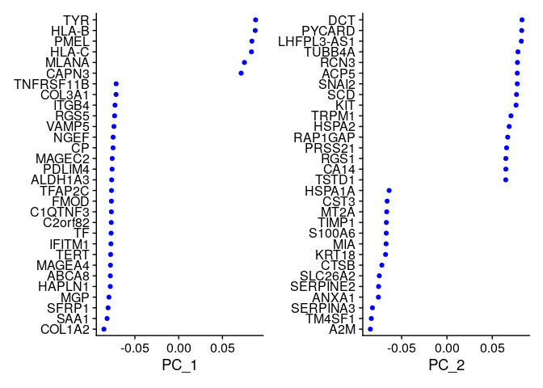

    DimPlot(tumor.data, reduction = "pca")

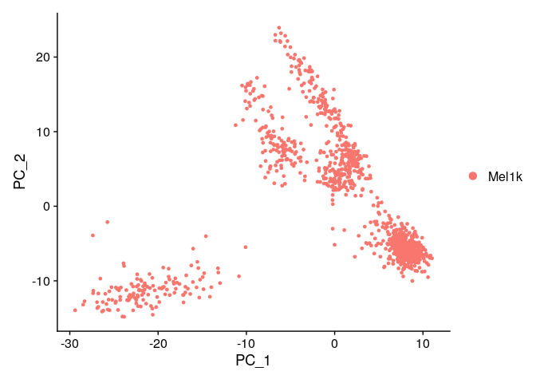

    DimHeatmap(tumor.data, dims = 1, cells = 500, balanced = TRUE)

    DimHeatmap(tumor.data, dims = 1:15, cells = 500, balanced = TRUE)

Step 6. Non-linear dimension reduction for visualization(tsne + umap)
---------------------------------------------------------------------

    # Perform t-SNE on the normalized data
    #tumor.data3k <- runTSNE(tumor.data3k, dims = 1:20, do.fast = TRUE)
    tumor.data <- RunTSNE(tumor.data , dims = 1:15)

    tumor.data <- RunUMAP(tumor.data, dims = 1:15)

    ## Warning: The default method for RunUMAP has changed from calling Python UMAP via reticulate to the R-native UWOT using the cosine metric
    ## To use Python UMAP via reticulate, set umap.method to 'umap-learn' and metric to 'correlation'
    ## This message will be shown once per session

    ## 22:27:53 UMAP embedding parameters a = 0.9922 b = 1.112

    ## 22:27:53 Read 1061 rows and found 15 numeric columns

    ## 22:27:53 Using Annoy for neighbor search, n_neighbors = 30

    ## 22:27:53 Building Annoy index with metric = cosine, n_trees = 50

    ## 0%   10   20   30   40   50   60   70   80   90   100%

    ## [----|----|----|----|----|----|----|----|----|----|

    ## **************************************************|
    ## 22:27:53 Writing NN index file to temp file /tmp/Rtmp3xM6VY/file29fd4be19160
    ## 22:27:53 Searching Annoy index using 1 thread, search_k = 3000
    ## 22:27:53 Annoy recall = 100%
    ## 22:27:54 Commencing smooth kNN distance calibration using 1 thread with target n_neighbors = 30
    ## 22:27:55 Initializing from normalized Laplacian + noise (using irlba)
    ## 22:27:55 Commencing optimization for 500 epochs, with 41068 positive edges
    ## 22:27:57 Optimization finished

    # Cluster the t-SNE data /DBScan
    tumor.data <- FindNeighbors(tumor.data, dims = 1:15)

    ## Computing nearest neighbor graph
    ## Computing SNN

    tumor.data <- FindClusters(tumor.data, resolution = 0.1)

    ## Modularity Optimizer version 1.3.0 by Ludo Waltman and Nees Jan van Eck
    ## 
    ## Number of nodes: 1061
    ## Number of edges: 34160
    ## 
    ## Running Louvain algorithm...
    ## Maximum modularity in 10 random starts: 0.9751
    ## Number of communities: 6
    ## Elapsed time: 0 seconds

    # Plot the t-SNE results colored by cluster
    p1 <- DimPlot(tumor.data, reduction = "umap" , group.by = "seurat_clusters", label = TRUE)
    p2 <- DimPlot(tumor.data, reduction = "tsne" , group.by = "seurat_clusters", label = TRUE)
        
    72

    ## [1] 72

    p1 + p2

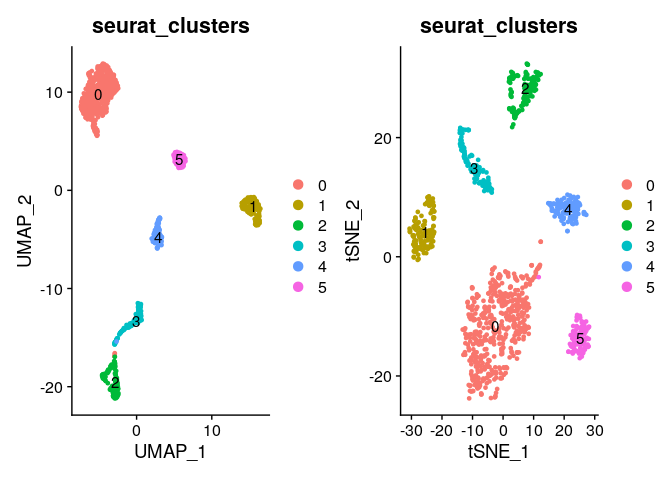

    tumor.data

    ## An object of class Seurat 
    ## 19950 features across 1061 samples within 1 assay 
    ## Active assay: RNA (19950 features, 2000 variable features)
    ##  3 dimensional reductions calculated: pca, tsne, umap

    TSNEPlot(tumor.data)

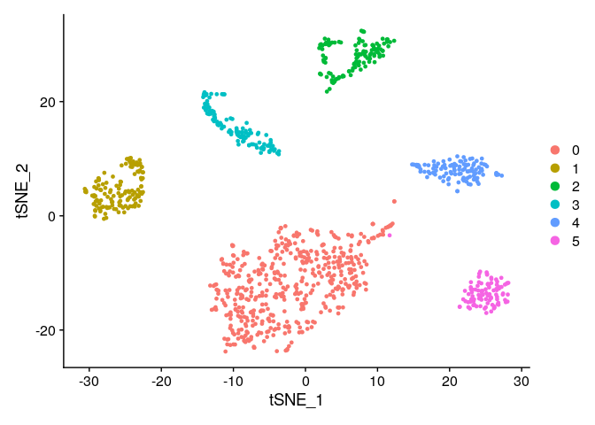

### higher-ranked PCs

**The number of principal components (PCs) that one can calculate for a
data set is equal to the number of highly variable genes or the number
of cells, whichever value is smaller. However, most of these PCs are not
informative and only represent random noise. Only the top PCs are
informative and represent differences among cell populations. Therefore,
instead of calculating all possible PCs, Seurat uses truncated PCA to
only calculate the first PCs, by default the top 50 PCs. One can change
that by setting the npcs parameter.** **Even then, one doesn’t
necessarily use all the calculated PCs. Determinting how many top PCs to
use is an art. There is no golden standard, and everyone has his/her own
understanding. The so-called elbow plot method can help with the
decision. It consists of plotting the explained variation as a function
of each PC, and picking the elbow of the curve as the number of PCs to
use.**

JackStraw
---------

    tumor.data <- JackStraw(tumor.data, num.replicate = 100)
    tumor.data <- ScoreJackStraw(tumor.data, dims = 1:15)
    JackStrawPlot(tumor.data, dims = 1:15)

    ## Warning: Removed 21742 rows containing missing values (geom_point).

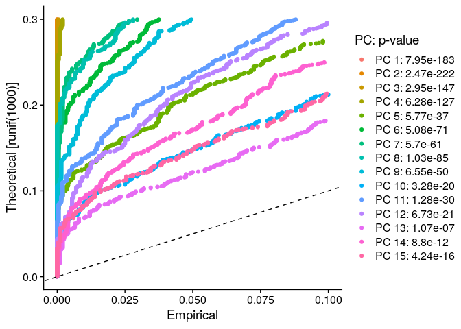

    ElbowPlot(tumor.data)

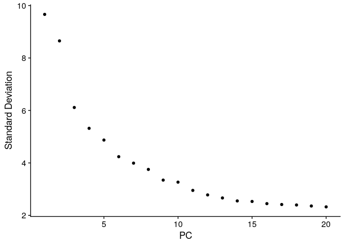

    # If you haven't installed UMAP, you can do so via reticulate::py_install(packages =
    # 'umap-learn')
    tumor.data <- RunUMAP(tumor.data, dims = 1:15)

    ## 22:28:10 UMAP embedding parameters a = 0.9922 b = 1.112

    ## 22:28:10 Read 1061 rows and found 15 numeric columns

    ## 22:28:10 Using Annoy for neighbor search, n_neighbors = 30

    ## 22:28:10 Building Annoy index with metric = cosine, n_trees = 50

    ## 0%   10   20   30   40   50   60   70   80   90   100%

    ## [----|----|----|----|----|----|----|----|----|----|

    ## **************************************************|
    ## 22:28:10 Writing NN index file to temp file /tmp/Rtmp3xM6VY/file29fd199652ec
    ## 22:28:10 Searching Annoy index using 1 thread, search_k = 3000
    ## 22:28:10 Annoy recall = 100%
    ## 22:28:11 Commencing smooth kNN distance calibration using 1 thread with target n_neighbors = 30
    ## 22:28:12 Initializing from normalized Laplacian + noise (using irlba)
    ## 22:28:12 Commencing optimization for 500 epochs, with 41068 positive edges
    ## 22:28:14 Optimization finished

step 7. Finds the marker genes
------------------------------

    # find all markers of cluster 2
    cluster2.markers <- FindMarkers(tumor.data, ident.1 = 2, min.pct = 0.25)

    ## For a more efficient implementation of the Wilcoxon Rank Sum Test,
    ## (default method for FindMarkers) please install the limma package
    ## --------------------------------------------
    ## install.packages('BiocManager')
    ## BiocManager::install('limma')
    ## --------------------------------------------
    ## After installation of limma, Seurat will automatically use the more 
    ## efficient implementation (no further action necessary).
    ## This message will be shown once per session

    head(cluster2.markers, n = 5)

    ##                   p_val avg_log2FC pct.1 pct.2     p_val_adj
    ## FAM3B     1.175030e-171  1.2227529 0.770 0.001 2.344186e-167
    ## BMX       6.672206e-153  1.5188828 0.849 0.030 1.331105e-148
    ## GJC3      1.593682e-128  1.6266023 0.849 0.052 3.179395e-124
    ## RNASE1    2.969260e-127  1.7370236 0.913 0.071 5.923674e-123
    ## LINC00479 1.834124e-118  0.9198054 0.611 0.011 3.659076e-114

    # find all markers distinguishing cluster 5 from clusters 0 and 3
    cluster5.markers <- FindMarkers(tumor.data, ident.1 = 5, ident.2 = c(0, 3), min.pct = 0.25)
    head(cluster5.markers, n = 5)

    ##                p_val avg_log2FC pct.1 pct.2     p_val_adj
    ## POSTN  5.144788e-130  2.2767906 0.895 0.003 1.026385e-125
    ## NUPR1  1.238956e-100  1.5169839 0.726 0.005  2.471717e-96
    ## WDR63   7.075911e-78  1.1945002 0.716 0.034  1.411644e-73
    ## TDRD3   1.198959e-77  1.8118076 0.968 0.163  2.391923e-73
    ## COL5A2  2.036599e-76  0.9115239 0.674 0.027  4.063015e-72

    # find markers for every cluster compared to all remaining cells, report only the positive
    # ones
    tumor.data.markers <- FindAllMarkers(tumor.data, only.pos = TRUE, min.pct = 0.25, logfc.threshold = 0.25)

    ## Calculating cluster 0

    ## Calculating cluster 1

    ## Calculating cluster 2

    ## Calculating cluster 3

    ## Calculating cluster 4

    ## Calculating cluster 5

    allmarkers <- tumor.data.markers %>%
      group_by(cluster) %>%
      slice_max(n = 5, order_by = avg_log2FC)

    allmarkers

    ## # A tibble: 30 × 7
    ## # Groups:   cluster [6]
    ##        p_val avg_log2FC pct.1 pct.2 p_val_adj cluster gene    
    ##        <dbl>      <dbl> <dbl> <dbl>     <dbl> <fct>   <chr>   
    ##  1 1.29e-154       1.97 0.926 0.198 2.57e-150 0       APOC2   
    ##  2 2.27e-130       1.84 0.724 0.005 4.52e-126 0       TRIML2  
    ##  3 3.42e-134       1.66 0.751 0.017 6.82e-130 0       SERPINA1
    ##  4 2.48e-101       1.59 0.658 0.051 4.95e- 97 0       SEPP1   
    ##  5 9.94e- 93       1.57 0.677 0.111 1.98e- 88 0       RDH5    
    ##  6 7.28e-206       2.72 0.925 0.004 1.45e-201 1       SAA1    
    ##  7 4.11e-138       2.37 1     0.125 8.21e-134 1       TF      
    ##  8 1.96e-190       2.13 0.947 0.022 3.90e-186 1       SFRP1   
    ##  9 1.64e-129       2.06 0.97  0.122 3.27e-125 1       RGS5    
    ## 10 1.44e-103       1.94 0.91  0.163 2.88e- 99 1       C1QTNF3 
    ## # … with 20 more rows

    VlnPlot(tumor.data, features = c(" APOC2 ", "TRIML2", "TF","SFRP1"))

    ## Warning in FetchData.Seurat(object = object, vars = features, slot = slot): The
    ## following requested variables were not found: APOC2

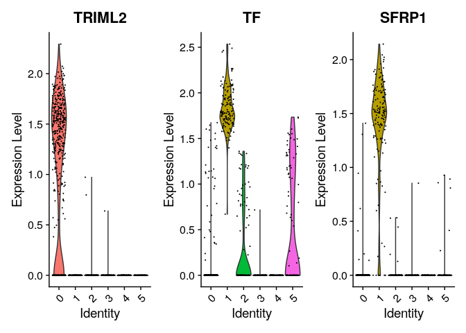

    # you can plot raw counts as well
    VlnPlot(tumor.data, features = c("C1QTNF3", "SEPP1"), slot = "counts", log = TRUE)

    FeaturePlot(tumor.data, features = c("TRIML2", "SAA1", "RNASE1", "RCN3", "OCA2", "EGFL8", "BCAN", "RGS1",
                                   "DCT"))

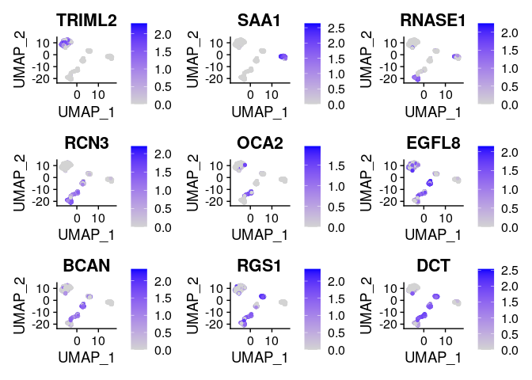

    VlnPlot(tumor.data, features = c(" APOC2 ", "TRIML2", "TF","SFRP1","RGS5","PDK4","GJC3","ADAMTS2", "MCOLN3","   WDR63"))

    ## Warning in FetchData.Seurat(object = object, vars = features, slot = slot): The
    ## following requested variables were not found: APOC2 , WDR63

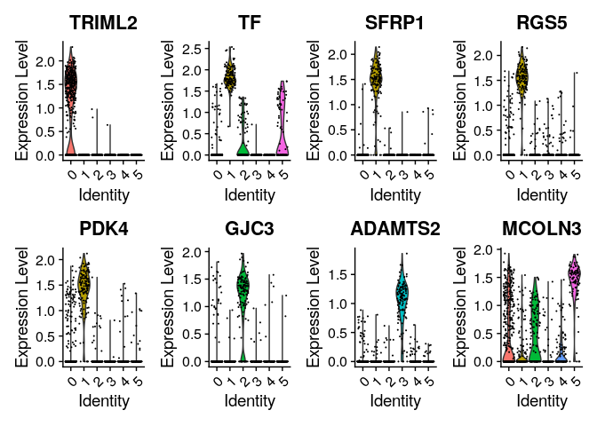

    # you can plot raw counts as well
    VlnPlot(tumor.data, features = c("C1QTNF3", "SEPP1"), slot = "counts", log =TRUE)

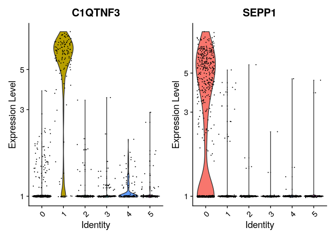

    FeaturePlot(tumor.data, features = c("TRIML2", "SAA1", "RNASE1", "RCN3", "OCA2", "EGFL8", "BCAN", "RGS1","DCT"))

    new.cluster.ids <- c("mel79", "mel81", "mel80", "mel78", "mel88", "mel89")
    names(new.cluster.ids) <- levels(tumor.data)
    tumor.data <- RenameIdents(tumor.data, new.cluster.ids)
    pl1= DimPlot(tumor.data, reduction = "umap", label = TRUE, pt.size = 0.5) + NoLegend()
    pl2= DimPlot(tumor.data, reduction = "tsne", label = TRUE, pt.size = 0.5) + NoLegend()

    pl1 +pl2

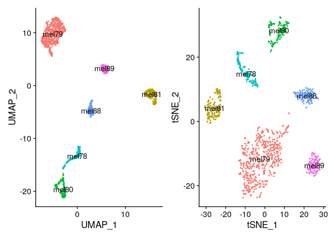
