# Non-malignant single cell RNA Analysis.

### Library Load :

    library(dplyr)

    library(Seurat)

    ## Attaching SeuratObject

    library(patchwork)
    library(data.table)

Step 1.Data Preparations and Subsetting:
----------------------------------------

    # Load the scdata dataset
    df.data <- read.table("scRNA_all.txt")
    Sys.sleep(2)
    #transpose data frame
    df.data <- transpose(df.data)
    Sys.sleep(2)
    # data preparation 
    #========================
    rownames(df.data) <- df.data$V1
    df.data <- df.data[,-1]
    colnames(df.data) <- df.data[1,]
    df.data <- df.data[-1,]

    # select non-malignant data object
    nonmal.data <- df.data[(which(df.data$`non-malignant cell type (1=T,2=B,3=Macro.4=Endo.,5=CAF;6=NK)` != 0)),]
    # select 13 tumors with >100 cells: 
    nonmal.data <- nonmal.data[(which(nonmal.data$tumor == "67" | nonmal.data$tumor == "75" | nonmal.data$tumor == "79" | nonmal.data$tumor == "88" | nonmal.data$tumor == "80" | nonmal.data$tumor == "89" | nonmal.data$tumor == "84" | nonmal.data$tumor == "94"| nonmal.data$tumor == "53"| nonmal.data$tumor == "58"| nonmal.data$tumor == "60"| nonmal.data$tumor == "72"| nonmal.data$tumor == "74")),]

    #drop 3 metadata columns
    nonmal.data <- nonmal.data[,-1]
    nonmal.data <- nonmal.data[,-1]
    nonmal.data <- nonmal.data[,-1]

    # Initialize the Seurat object with the raw (non-normalized data).
    celltype.data <- CreateSeuratObject(counts =  t(nonmal.data), project = "NonMel3k", min.cells = 3, min.features = 10)

    ## Warning: Feature names cannot have underscores ('_'), replacing with dashes
    ## ('-')

    celltype.data

    ## An object of class Seurat 
    ## 21794 features across 2716 samples within 1 assay 
    ## Active assay: RNA (21794 features, 0 variable features)

Step 2.Quality Control:
-----------------------

    # The [[ operator can add columns to object metadata. This is a great place to stash QC stats
    celltype.data[["percent.mt"]] <- PercentageFeatureSet(celltype.data, pattern = "^MT-")

    # Show QC metrics for the first 5 cells
    head(celltype.data@meta.data, 5)

    ##                           orig.ident nCount_RNA nFeature_RNA percent.mt
    ## Cy72_CD45_H02_S758_comb     NonMel3k   7143.363         3365          0
    ## CY58_1_CD45_B02_S974_comb   NonMel3k   8915.833         3637          0
    ## Cy72_CD45_D09_S717_comb     NonMel3k   8079.284         2826          0
    ## Cy74_CD45_A03_S387_comb     NonMel3k   7377.718         2563          0
    ## Cy74_CD45_F09_S453_comb     NonMel3k   7230.710         2682          0

    # Visualize QC metrics as a violin plot
    VlnPlot(celltype.data, features = c("nFeature_RNA" , "nCount_RNA", "percent.mt"), ncol = 3)

    ## Warning in SingleExIPlot(type = type, data = data[, x, drop = FALSE], idents =
    ## idents, : All cells have the same value of percent.mt.

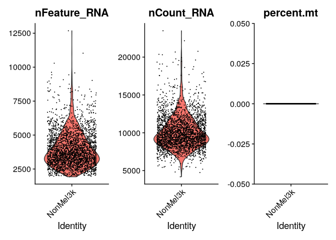

    # FeatureScatter is typically used to visualize feature-feature relationships, but can be used
    # for anything calculated by the object, i.e. columns in object metadata, PC scores etc.

    plot1 <- FeatureScatter(celltype.data, feature1 = "nCount_RNA", feature2 = "percent.mt")

    ## Warning in cor(x = data[, 1], y = data[, 2]): the standard deviation is zero

    plot2 <- FeatureScatter(celltype.data, feature1 = "nCount_RNA", feature2 = "nFeature_RNA")
    plot1 

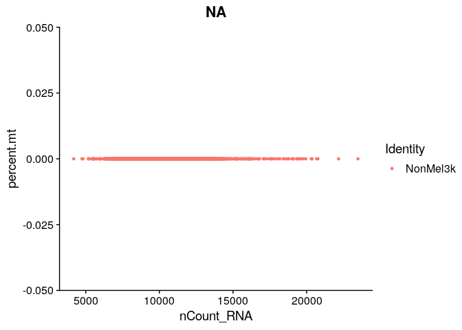

    plot2

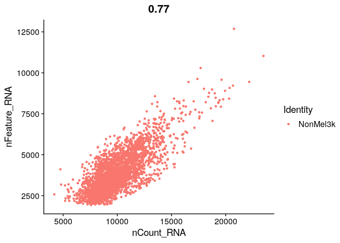

### FILTER THE DATA

    celltype.data <- subset(celltype.data, subset = nFeature_RNA > 200 & nFeature_RNA < 12500 & percent.mt < 5)

Step 3. Normalizations and Log Transformation:
----------------------------------------------

***DATA IS ALREADY NORMALIZED***

Feature selection for following heterogeneity analysis:
-------------------------------------------------------

**by looking for cell groups with distinct molecular signatures.
However, not every gene has the same level of information and the same
contribution when trying to identify different cell groups. For
instance, genes with low expression levels, and those with similar
expression levels across all cells, are not very informative and may
dilute differences between distinct cell groups. Therefore, it is
necessary to perform a proper feature selection**

    celltype.data <- FindVariableFeatures(celltype.data, selection.method = "vst", nfeatures = 2000)
    # Identify the 10 most highly variable genes
    top10 <- head(VariableFeatures(celltype.data), 10)

    # plot variable features with and without labels
    ploty <- VariableFeaturePlot(celltype.data)
    plotx <- LabelPoints(plot = ploty, points = top10, repel = TRUE)

    ## When using repel, set xnudge and ynudge to 0 for optimal results

    plotx

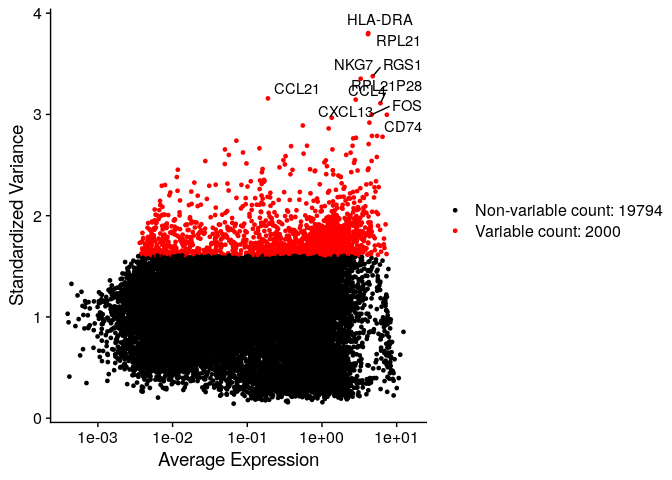

Step 4. Data Scaling
--------------------

    all.genes <- rownames(celltype.data)
    celltype.data <- ScaleData(celltype.data, features = all.genes)

    ## Centering and scaling data matrix

Step 5. Linear dimensionality reduction using principal component analysis (PCA)
--------------------------------------------------------------------------------

    celltype.data <- RunPCA(celltype.data, features = VariableFeatures(object = celltype.data))

    ## PC_ 1 
    ## Positive:  CST3, SERPING1, GSN, TMEM176B, FN1, CTSL1, CD9, TSPAN4, ENG, THBS1 
    ##     TIMP1, IGFBP7, NNMT, S100A16, SEPP1, TGFBI, CD14, FSTL1, FCGRT, MMP2 
    ##     TMEM176A, TUBB6, BGN, NUPR1, IER3, GPNMB, CNN3, HYAL2, CXCL12, THY1 
    ## Negative:  CCL5, CXCR4, PTPRCAP, CD69, CD52, CORO1A, TSC22D3, CD37, CD3D, MS4A1 
    ##     CCR7, LTB, CD2, TXNIP, SELL, IL7R, BANK1, RHOH, RAC2, CD79A 
    ##     LY9, CD19, RPL13A, PIM2, TBC1D10C, CD22, LCK, PIK3IP1, ZAP70, CD79B 
    ## PC_ 2 
    ## Positive:  BANK1, MS4A1, CD19, CD79A, CD22, NCF1C, NCF1, NAPSB, CTSH, IGLL5 
    ##     BLNK, IRF8, ALOX5, CD83, FCRLA, VPREB3, CD40, BTK, ADAM28, HLA-DOB 
    ##     TCL1A, FCER2, CD79B, HVCN1, LY86, HLA-DMB, RNASE6, STAP1, CR2, CNR2 
    ## Negative:  CD2, IL32, CD3D, NKG7, CST7, CD8A, PRF1, KLRK1, TIGIT, GZMA 
    ##     SRGN, PDCD1, GZMK, CTSW, CCL4, ITM2A, CD8B, SIRPG, LCK, ZAP70 
    ##     CCL4L2, CCL4L1, HCST, IFITM1, SH2D1A, CTLA4, CD27, APOBEC3G, ID2, SLA 
    ## PC_ 3 
    ## Positive:  NNMT, BGN, FSTL1, TFPI, EFEMP1, RAMP2, IGFBP7, CYR61, THY1, CDH5 
    ##     MGP, FMOD, TM4SF1, S100A16, GNG11, IL33, VWF, ECSCR, CLDN5, CNN3 
    ##     CD34, CTGF, RARRES2, MFAP2, C1R, RAMP3, CLU, HYAL2, SDPR, EGFL7 
    ## Negative:  SERPINA1, CSF1R, CD163, FCGR1A, HCK, CD14, TYROBP, FCER1G, MS4A4A, CPVL 
    ##     IGSF6, HLA-DMB, HLA-DQB1, C3AR1, LST1, VSIG4, S100A9, HLA-DQA1, FPR1, HLA-DRA 
    ##     C1QA, C1QC, AIF1, HLA-DRB5, LY86, TREM2, HLA-DRB1, HLA-DPA1, NCF1, TNFSF13 
    ## PC_ 4 
    ## Positive:  CD79A, MS4A1, CD19, CD79B, BANK1, CD22, FCRLA, HLA-DOB, IGLL5, VPREB3 
    ##     NAPSB, CR2, BLNK, TCL1A, IRF8, ELK2AP, FCER2, STAP1, CNR2, CXCR5 
    ##     TYMS, HVCN1, TK1, ZWINT, CYBASC3, GINS2, PKIG, HLA-DRA, HLA-DQA1, ADAM28 
    ## Negative:  CD14, CD163, FCER1G, CSF1R, SERPINA1, TYROBP, S100A9, CPVL, FCGR1A, MS4A4A 
    ##     C3AR1, TMEM176B, C1QA, TMEM176A, FCGR3A, VSIG4, C1QC, IGSF6, C1QB, CST3 
    ##     FPR1, FCN1, AIF1, HCK, IL1B, TREM1, SERPING1, TREM2, MS4A6A, TGFBI 
    ## PC_ 5 
    ## Positive:  IL7R, CD4, CD40LG, CCR7, AQP3, SELL, LTB, TNFRSF25, GPR183, MAL 
    ##     LDHB, CCR4, LDLRAP1, CD5, ANXA1, TNFSF8, NOSIP, PIK3IP1, JUNB, LOC100128420 
    ##     GAS5, KLRB1, TSC22D3, FXYD5, FOS, RGS10, CCDC109B, RPL13A, NFKBIA, LAT 
    ## Negative:  NKG7, HLA-DRB1, CCL4, CD8A, CCL4L2, CCL4L1, HLA-DRB5, KLRK1, HLA-DPA1, PRF1 
    ##     CD74, HLA-DRA, CD8B, CCL3, GZMA, CCL3L3, CST7, FCRL3, VCAM1, HLA-DQA1 
    ##     CCL5, HLA-DMA, CTSW, GZMK, IFNG, KLRC4, KLRC3, GZMB, HLA-DQB1, GZMH

    # Examine and visualize PCA results a few different ways
    print(celltype.data[["pca"]], dims = 1:5, nfeatures = 5)

    ## PC_ 1 
    ## Positive:  CST3, SERPING1, GSN, TMEM176B, FN1 
    ## Negative:  CCL5, CXCR4, PTPRCAP, CD69, CD52 
    ## PC_ 2 
    ## Positive:  BANK1, MS4A1, CD19, CD79A, CD22 
    ## Negative:  CD2, IL32, CD3D, NKG7, CST7 
    ## PC_ 3 
    ## Positive:  NNMT, BGN, FSTL1, TFPI, EFEMP1 
    ## Negative:  SERPINA1, CSF1R, CD163, FCGR1A, HCK 
    ## PC_ 4 
    ## Positive:  CD79A, MS4A1, CD19, CD79B, BANK1 
    ## Negative:  CD14, CD163, FCER1G, CSF1R, SERPINA1 
    ## PC_ 5 
    ## Positive:  IL7R, CD4, CD40LG, CCR7, AQP3 
    ## Negative:  NKG7, HLA-DRB1, CCL4, CD8A, CCL4L2

    VizDimLoadings(celltype.data, dims = 1:2, reduction = "pca")

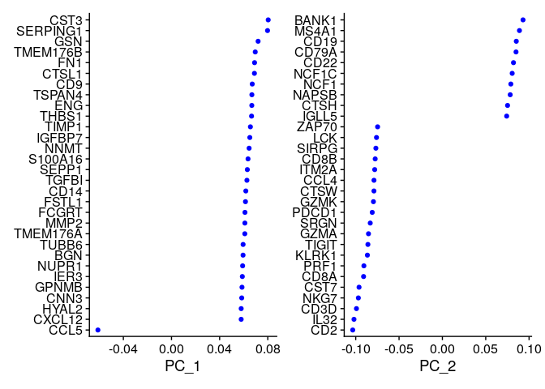

    DimPlot(celltype.data, reduction = "pca")

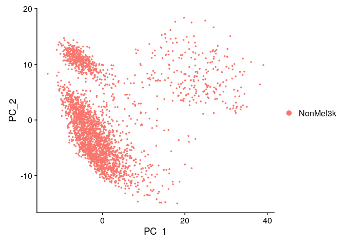

    DimHeatmap(celltype.data, dims = 1, cells = 500, balanced = TRUE)

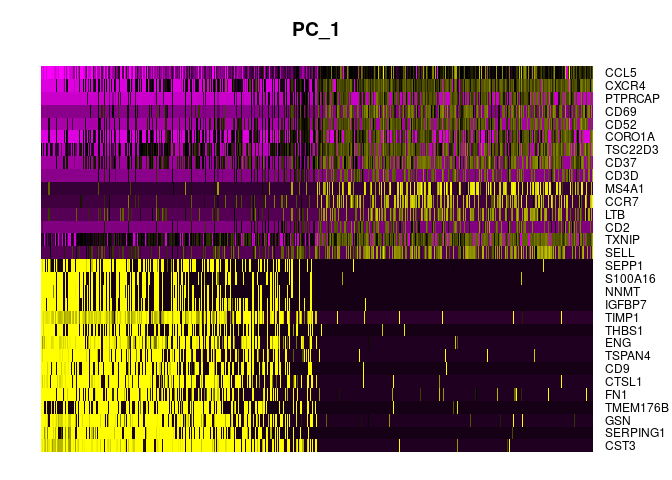

    DimHeatmap(celltype.data, dims = 1:15, cells = 500, balanced = TRUE)

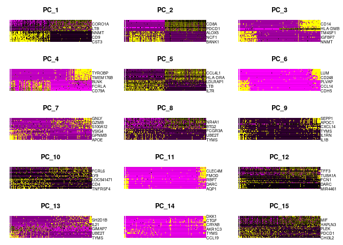

Step 6. Non-linear dimension reduction for visualization(tsne + umap)
---------------------------------------------------------------------

    # Perform t-SNE on the normalized data
    #celltype.data3k <- runTSNE(celltype.data3k, dims = 1:20, do.fast = TRUE)
    celltype.data <- RunTSNE(celltype.data , dims = 1:15)
    celltype.data <- RunUMAP(celltype.data, dims = 1:15)

    ## Warning: The default method for RunUMAP has changed from calling Python UMAP via reticulate to the R-native UWOT using the cosine metric
    ## To use Python UMAP via reticulate, set umap.method to 'umap-learn' and metric to 'correlation'
    ## This message will be shown once per session

    ## 11:47:03 UMAP embedding parameters a = 0.9922 b = 1.112

    ## 11:47:03 Read 2715 rows and found 15 numeric columns

    ## 11:47:03 Using Annoy for neighbor search, n_neighbors = 30

    ## 11:47:03 Building Annoy index with metric = cosine, n_trees = 50

    ## 0%   10   20   30   40   50   60   70   80   90   100%

    ## [----|----|----|----|----|----|----|----|----|----|

    ## **************************************************|
    ## 11:47:04 Writing NN index file to temp file /tmp/RtmpZoNVBR/filed28ec9cc2a
    ## 11:47:04 Searching Annoy index using 1 thread, search_k = 3000
    ## 11:47:04 Annoy recall = 100%
    ## 11:47:05 Commencing smooth kNN distance calibration using 1 thread with target n_neighbors = 30
    ## 11:47:06 Initializing from normalized Laplacian + noise (using irlba)
    ## 11:47:07 Commencing optimization for 500 epochs, with 106360 positive edges
    ## 11:47:10 Optimization finished

    # Cluster the t-SNE data
    celltype.data <- FindNeighbors(celltype.data, dims = 1:15)

    ## Computing nearest neighbor graph
    ## Computing SNN

    celltype.data <- FindClusters(celltype.data, resolution = 0.03)

    ## Modularity Optimizer version 1.3.0 by Ludo Waltman and Nees Jan van Eck
    ## 
    ## Number of nodes: 2715
    ## Number of edges: 89977
    ## 
    ## Running Louvain algorithm...
    ## Maximum modularity in 10 random starts: 0.9829
    ## Number of communities: 6
    ## Elapsed time: 0 seconds

    # Plot the t-SNE results colored by cluster
    p1 <- DimPlot(celltype.data, reduction = "umap" , group.by = "seurat_clusters",label = TRUE)
    p2 <- DimPlot(celltype.data, reduction = "tsne" , group.by = "seurat_clusters",label = TRUE)

    p1 + p2

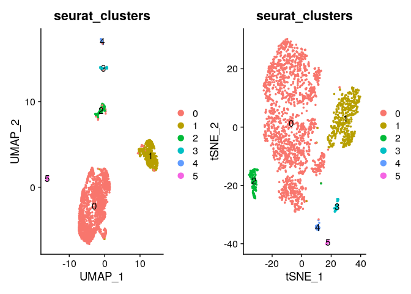

    table(celltype.data$seurat_clusters)

    ## 
    ##    0    1    2    3    4    5 
    ## 1977  504  121   48   38   27

    celltype.data$seurat_clusters[1:6]

    ##   Cy72_CD45_H02_S758_comb CY58_1_CD45_B02_S974_comb   Cy72_CD45_D09_S717_comb 
    ##                         1                         0                         0 
    ##   Cy74_CD45_A03_S387_comb   Cy74_CD45_F09_S453_comb CY58_1_CD45_D03_S999_comb 
    ##                         0                         0                         0 
    ## Levels: 0 1 2 3 4 5

JackStraw
---------

    celltype.data <- JackStraw(celltype.data, num.replicate = 100)
    celltype.data <- ScoreJackStraw(celltype.data, dims = 1:20)
    JackStrawPlot(celltype.data, dims = 1:15)

    ## Warning: Removed 21010 rows containing missing values (geom_point).

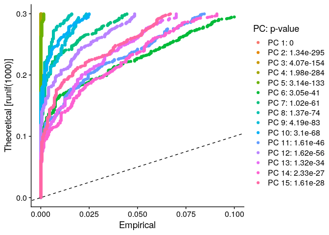

### ElbowPlot

    ElbowPlot(celltype.data)

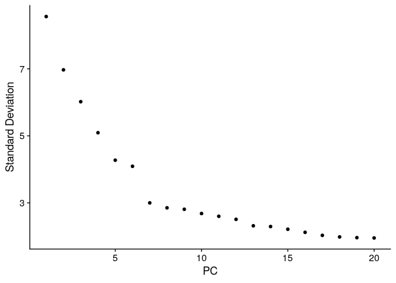

Step 7. Finds Cell Markers :
----------------------------

    # find all markers of cluster 0
    cluster2.markers <- FindMarkers(celltype.data, ident.1 = 0, min.pct = 0.25)

    ## For a more efficient implementation of the Wilcoxon Rank Sum Test,
    ## (default method for FindMarkers) please install the limma package
    ## --------------------------------------------
    ## install.packages('BiocManager')
    ## BiocManager::install('limma')
    ## --------------------------------------------
    ## After installation of limma, Seurat will automatically use the more 
    ## efficient implementation (no further action necessary).
    ## This message will be shown once per session

    head(cluster2.markers, n = 5)

    ##                p_val avg_log2FC pct.1 pct.2     p_val_adj
    ## TCF4    0.000000e+00  -1.613194 0.049 0.734  0.000000e+00
    ## MEF2C  4.966267e-292  -1.558023 0.044 0.684 1.082348e-287
    ## CD3D   3.893562e-285   2.746507 0.891 0.046 8.485630e-281
    ## BCL11A 1.519269e-284  -1.866049 0.028 0.631 3.311095e-280
    ## BANK1  5.524569e-282  -2.181414 0.029 0.627 1.204025e-277

    # find all markers distinguishing cluster 5 from clusters 0 and 3
    cluster5.markers <- FindMarkers(celltype.data, ident.1 = 5, ident.2 = c(0, 3), min.pct = 0.25)
    head(cluster5.markers, n = 5)

    ##                 p_val avg_log2FC pct.1 pct.2     p_val_adj
    ## CLEC14A  0.000000e+00   2.417836 0.926 0.002  0.000000e+00
    ## PLVAP    0.000000e+00   2.761785 1.000 0.004  0.000000e+00
    ## RAMP2   1.295162e-302   2.556100 1.000 0.006 2.822677e-298
    ## RAMP3   3.366602e-273   2.644721 0.926 0.006 7.337172e-269
    ## CDH5    1.237799e-269   2.433655 0.963 0.008 2.697660e-265

    # find markers for every cluster compared to all remaining cells, report only the positive
    # ones
    celltype.data.markers <- FindAllMarkers(celltype.data, only.pos = TRUE, min.pct = 0.25, logfc.threshold = 0.25)

    ## Calculating cluster 0

    ## Calculating cluster 1

    ## Calculating cluster 2

    ## Calculating cluster 3

    ## Calculating cluster 4

    ## Calculating cluster 5

    allmarkers <- celltype.data.markers %>%
      group_by(cluster) %>%
      slice_max(n = 5, order_by = avg_log2FC)

    allmarkers

    ## # A tibble: 30 × 7
    ## # Groups:   cluster [6]
    ##        p_val avg_log2FC pct.1 pct.2 p_val_adj cluster gene 
    ##        <dbl>      <dbl> <dbl> <dbl>     <dbl> <fct>   <chr>
    ##  1 3.89e-285       2.75 0.891 0.046 8.49e-281 0       CD3D 
    ##  2 9.33e-276       2.57 0.876 0.038 2.03e-271 0       CD2  
    ##  3 2.68e-268       2.33 0.893 0.133 5.84e-264 0       IL32 
    ##  4 6.30e-275       2.27 0.877 0.043 1.37e-270 0       CD3E 
    ##  5 3.09e-129       2.19 0.573 0.053 6.74e-125 0       NKG7 
    ##  6 0               2.75 0.97  0.081 0         1       MS4A1
    ##  7 0               2.72 0.976 0.067 0         1       CD79A
    ##  8 0               2.60 0.879 0.035 0         1       BANK1
    ##  9 0               2.57 0.806 0.014 0         1       CD19 
    ## 10 3.65e-274       2.36 0.706 0.062 7.95e-270 1       IGLL5
    ## # … with 20 more rows

    VlnPlot(celltype.data, features = c("MS4A1", "TCL1A", "CD79A","LTB"))

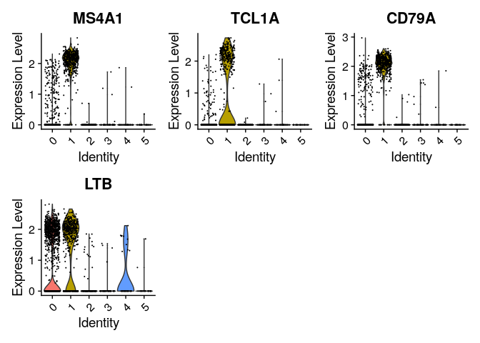

    # you can plot raw counts as well
    VlnPlot(celltype.data, features = c("NKG7", "PF4"), slot = "counts", log = TRUE)

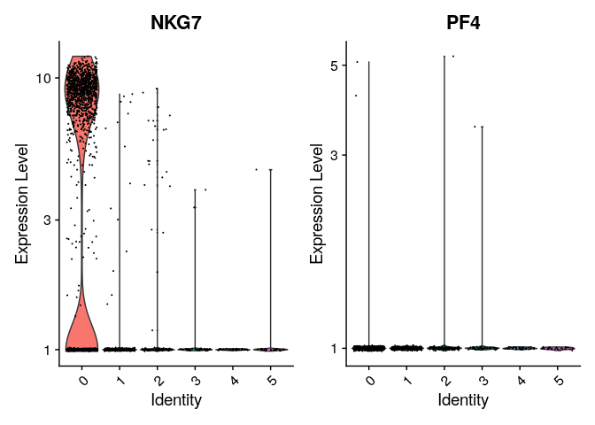

    FeaturePlot(celltype.data, features = c("MS4A1", "GNLY", "CD3E", "CD14", "FCER1A", "FCGR3A", "LYZ", "PPBP",
                                   "CD8A"))

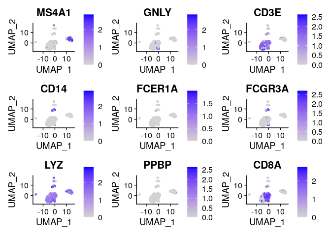

    celltype.data.markers %>%
      group_by(cluster) %>%
      top_n(n = 10, wt = avg_log2FC) -> top10
    DoHeatmap(celltype.data, features = top10$gene) + NoLegend()

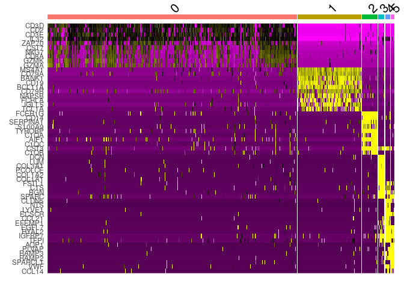

## Annotate cell clusters

    new.cluster.ids <- c("T cells", "b cells", "Macrophages", "CAF cells", "Endothelial cells", " NK cells")
    names(new.cluster.ids) <- levels(celltype.data)
    celltype.data <- RenameIdents(celltype.data, new.cluster.ids)
    DimPlot(celltype.data, reduction = "umap", label = TRUE, pt.size = 0.5) + NoLegend() 

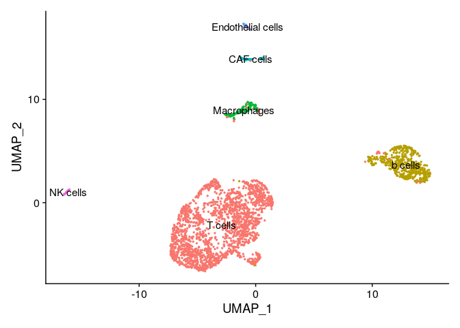

**all markers variable contains the top 5 markers in each 6 cluster/cell type then,I extract cell type from these markers manually,from Human Cell Atlas data base**

1.Cluster 0: CD2 CD3D CD3E IL32 NKG7 (T cells) 

2.cluster 1 : CD79A BANK1 CD19 IGLL5 (B cells) 

3.Cluster 2: FCER1G CD14 TYROBO CST3 C1QB (Macrophages)

4.Cluster 3: DCN LUM COL3A1 COL1A2 COL1A1 (CAF)

5.cluster 4: CLDN5 CCL21 EFEMP1 IGFBP7 TFPI (Endothelial cells) 

6.cluster 5: AQP1 PLVAP RAMP3 SPARCL1 IGFBP7 (NK cells)

    DimPlot(celltype.data, reduction = "tsne", label = TRUE, pt.size = 0.5) + NoLegend()

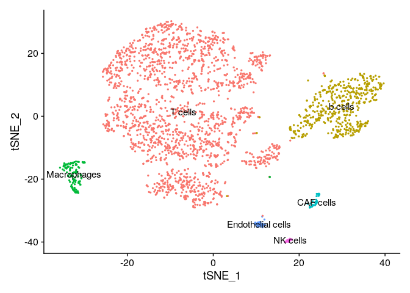

## Reproduce the clustering part(cell types) from the paper :
 
After performing clustering using PCA, t-SNE, and UMAP, you will notice the emergence of six clearly defined clusters on both UMAP and t-SNE plots. Each of these clusters corresponds to a different cell type, with each cell type exhibiting distinct genetic and expression characteristics that dictate its placement in one of the six clusters. Additionally, cells within each cluster tend to show similar RNA expression profiles due to shared genetic attributes, thus underscoring the differential behavior of the tumor microenvironment.

